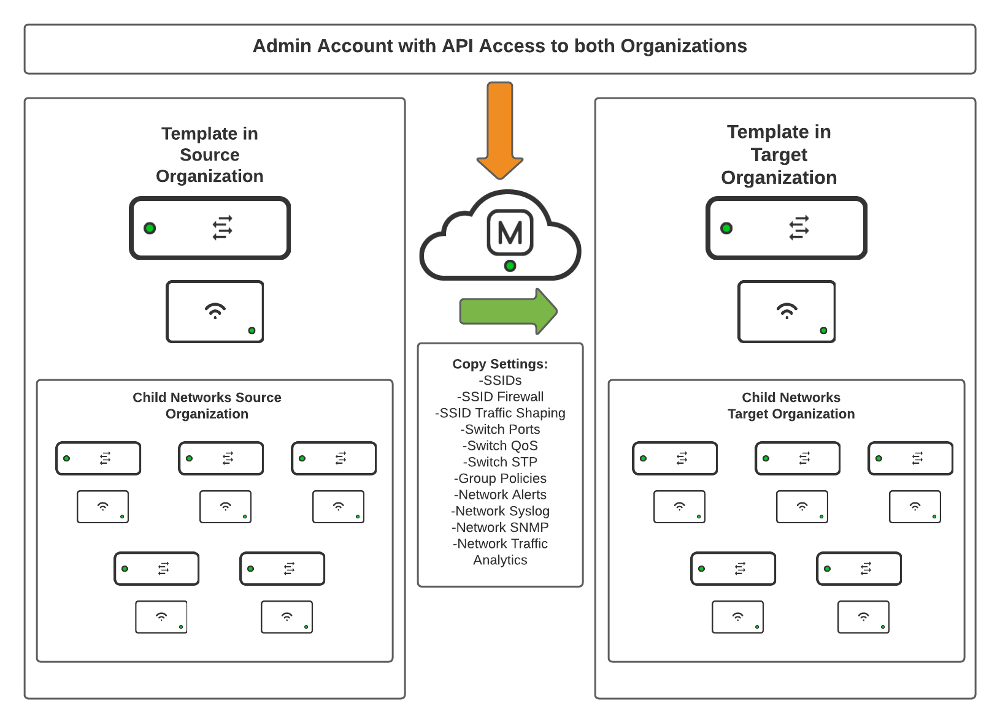
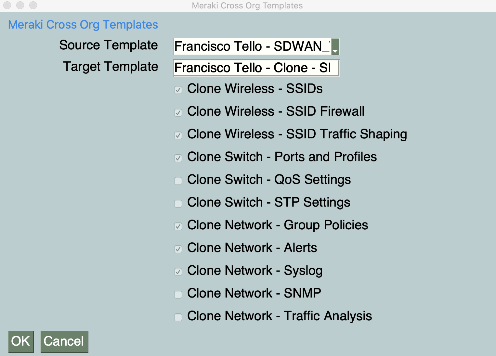

# meraki-crossorg-templates

This is a simple application that can clone switch and SSID settings from one template in one source organization to another template in a target organization. The use case is for customers who have very large (over 25000 switches and APs) but very simple deployments, like elementary schools.

**How to use:**
1. Install Python 3 on your workstation. You can find Python distributions and instructions here: https://www.python.org/downloads/
2. Run pip install -r requirements.txt to install the required Python packages for the project
4. Add your Meraki API key to the credentials.py file between the quotation marks. You can find instructions on how to generate an API key here: https://documentation.meraki.com/General_Administration/Other_Topics/Cisco_Meraki_Dashboard_API
5. Make sure this API key has write access to both the source and target organization. You can add your account as Full Organization Admin to both organizations by following the instructions here: https://documentation.meraki.com/General_Administration/Managing_Dashboard_Access/Managing_Dashboard_Administrators_and_Permissions
6. Run the script with python main.py
7. Select your source and target templates
8. Check the boxes for copying SSIDs and/or switch ports

This is a sample image of the application being run. The names of the templates in your environment will probably be different.

**Current capabilities:**
1. Clone SSIDs
2. Clone SSID Firewalls
3. Clone SSID Traffic Shaping
4. Clone Switch Profile Ports
5. Clone Switch QoS
6. Clone Switch STP
7. Clone Network Group Policies
8. Clone Network Alerts
9. Clone Network Traffic Analytics
10. Clone Network Syslog
11. Clone Network SNMP

**Caveats:**
1. For copying switch settings, both the source and target templates must have switch profiles created for the same switch models and the profiles should have matching names
2. The profiles themselves can be empty of configurations, but they have to exist before running the script
3. It is highly recommended that you test this in a test template before running in a production template
